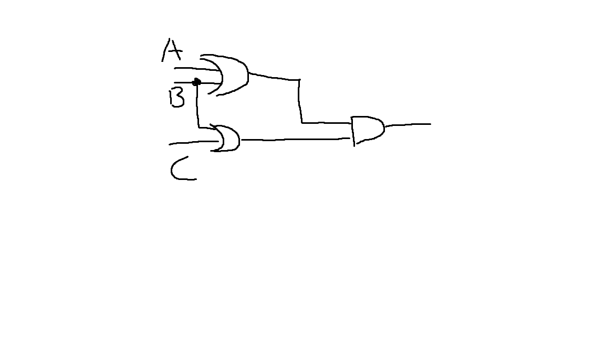

# Homework 05

## Part 1

(1)

x = A$\cdot$B

|A|B|X|
|:-:|:-:|:-:|
|1|1|1|
|1|0|0|
|0|1|0|
|0|0|0|

Only if the two inputs are true, can the output be ture.

(2)

X = A ⊕ B

|A|B|X|
|:-:|:-:|:-:|
|1|1|0|
|1|0|1|
|0|1|1|
|0|0|0|

When the two inputs are different, the outputs is true. Otherwise, the outputs is false.

(3)

(4)

|A|B|output|
|:-:|:-:|:-:|
|1|1|1|
|1|0|0|
|0|1|1|
|0|0|1|

(5)

|A|B|(AB)'|
|:-:|:-:|:-:|
|1|1|0|
|1|0|1|
|0|1|1|
|0|0|1|

|A|B| A'+B'|
|:-:|:-:|:-:|
|1|1|0|
|1|0|1|
|0|1|1|
|0|0|1|

The mean of circuit equivalence is that both circuits produce the exact same output for each input value combination.

## Part 2

(6)

(7)

$$X_{8}X_{7}X_{6}X_{5}1111$$
$$X_{8}X_{7}X_{6}X_{5}X_{4}'X_{3}'X_{2}'X_{1}'$$
$$X_{8}X_{7}X_{6}X_{5}X_{4}'X_{3}'X_{2}'X_{1}'$$

## Part 3

><dl>
><dt><strong>Logic gate</strong></dt>
><dd>In electronics, a logic gate is an idealized or physical device implementing a Boolean function; that is, it performs a logical operation on one or more binary inputs and produces a single binary output. </dd>
><dt><strong>Boolean algebra</strong></dt>
><dd>In mathematics and mathematical logic, Boolean algebra is the branch of algebra in which the values of the variables are the truth values true and false, usually denoted 1 and 0 respectively. </dd>
></dl>

自学存储电路。维基百科：“Flip-flop”，选择中文：
1)Flip-flop 中文翻译是？
2)How many bits information does a SR latch store?

(1)

触发器

(2)

1 bit