# 使用Visual Studio 2017编写c语言程序

## 1. 下载安装Visual Studio 2017

下载Visual Studio community 2017： [https://visualstudio.microsoft.com/zh-hans/](https://visualstudio.microsoft.com/zh-hans/)

运行下载下来的

进行安装

进入如下界面（我这个是已经安装好的所以有点不一样）
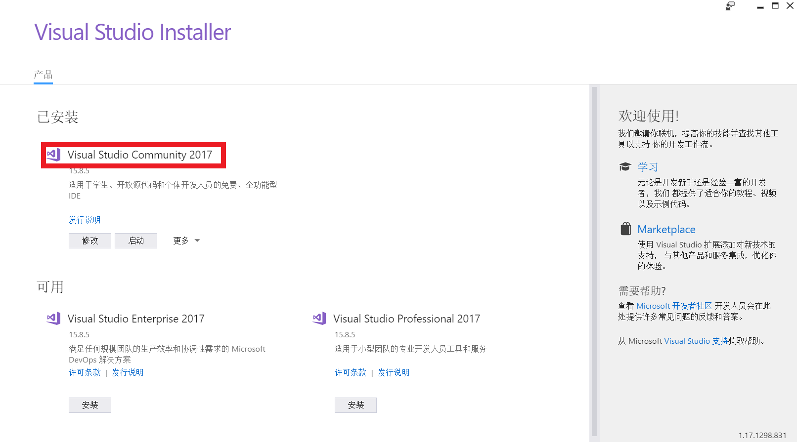
<b>*需要注意的是我们要安装的是community版，其他版本是要收费的</b>

点击安装进入如下界面
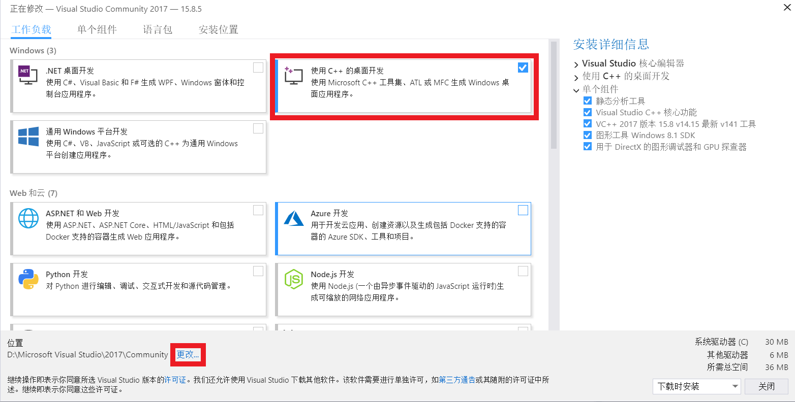
点击**更改**更改安装位置，勾选使用c++的桌面开发选项

然后就是等待下载安装完成。

## 2. 启动Visual Studio 2017编写c语言程序

第一次启动Visual Studio 2017会让我们进行个性化设置。

之后的界面大概是这样的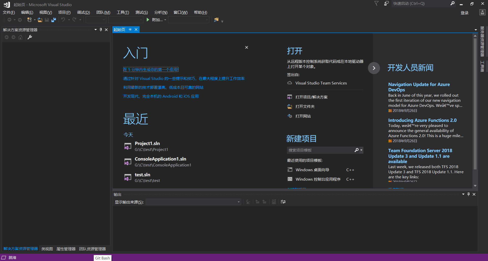

点击文件>新建>项目
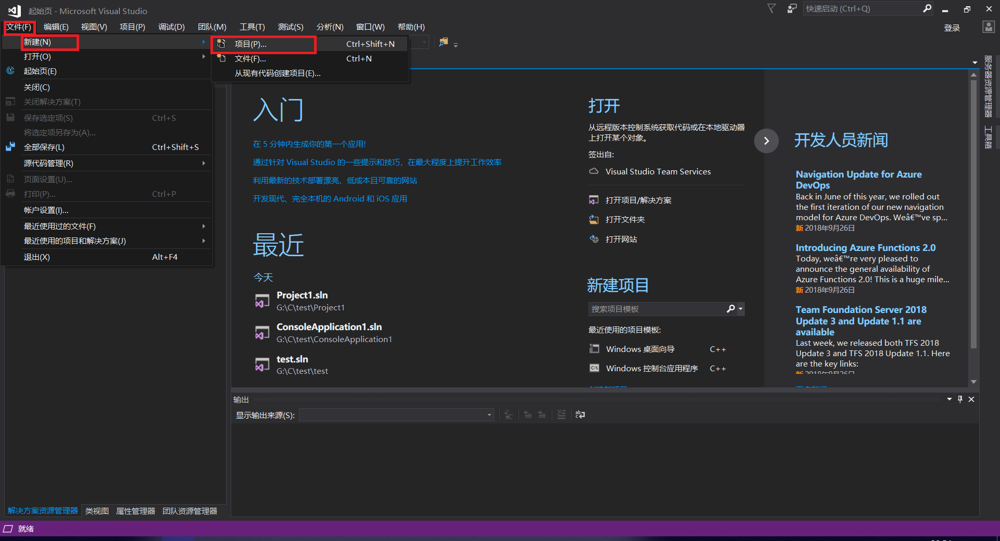

选择windows桌面向导并更改名称和位置
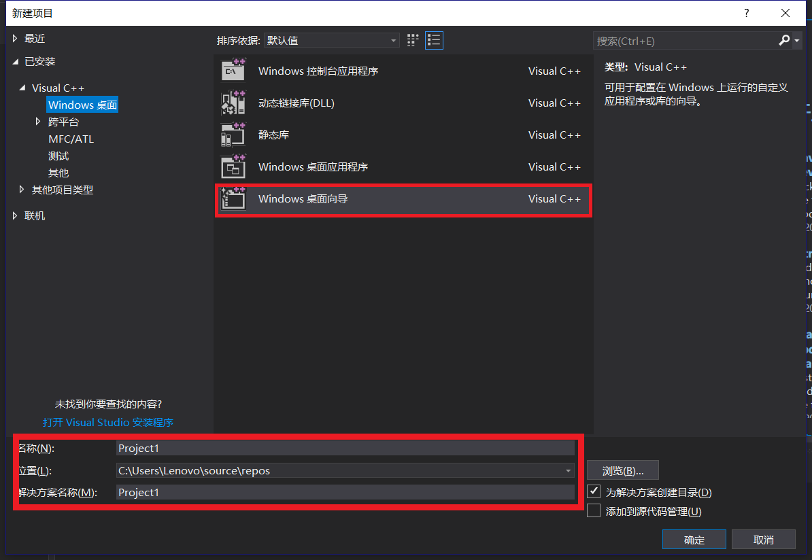

勾选空项目并取消SDL检查然后确定
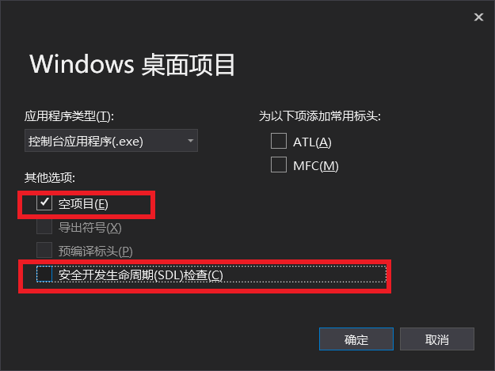

右键点击源文件>添加>新建项
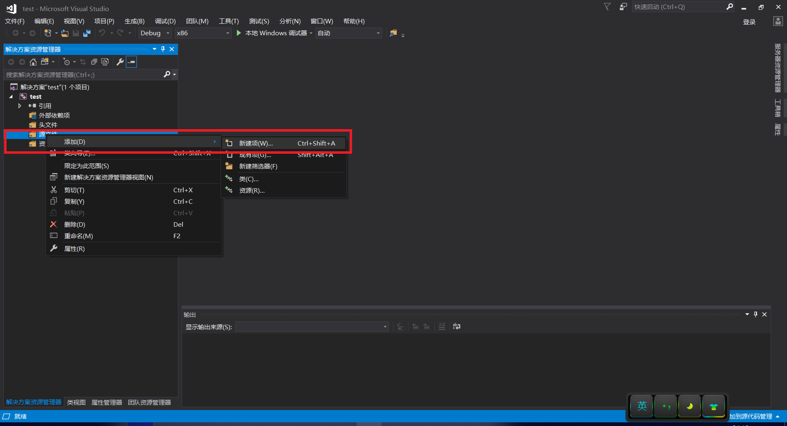

选择c++文件并把名称改为以 .c结尾，点击添加
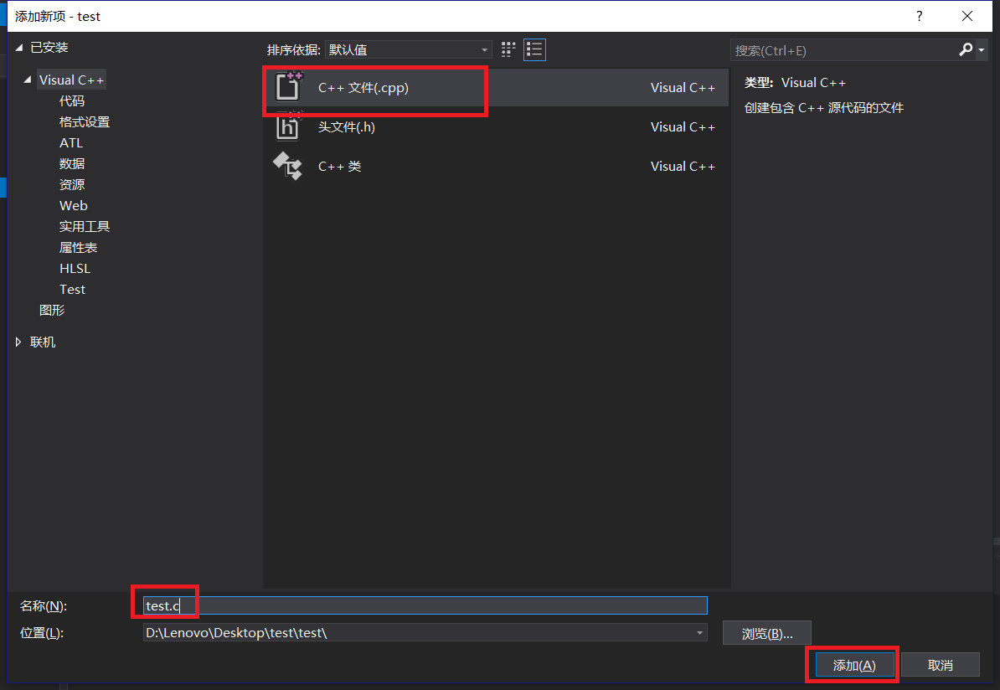

在左边点击源文件下刚刚我们创建的文件就可以在右边空白处编写c语言代码了
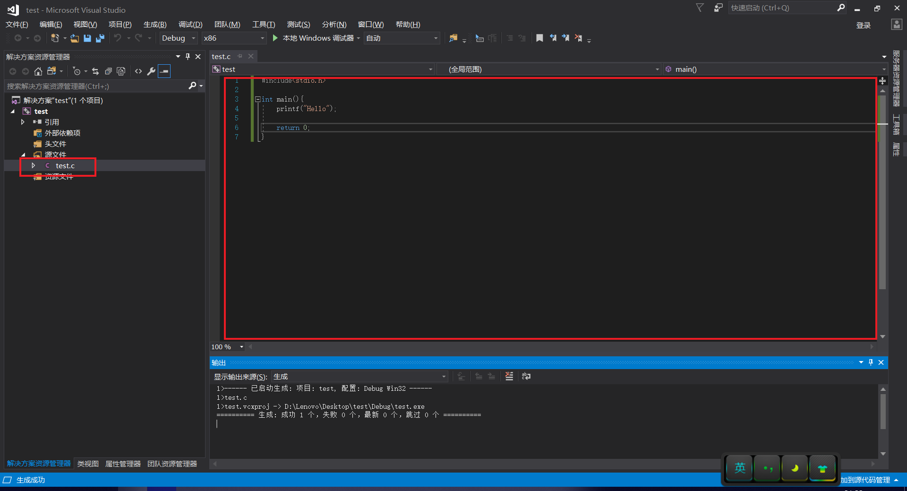

选择 调试>开始执行（不调试）或者使用快捷键ctrl+F5进行编译
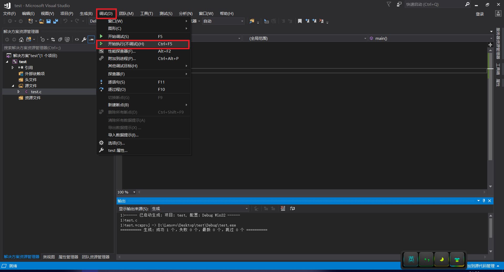

在下方的输出窗口内可查看程序的一些信息
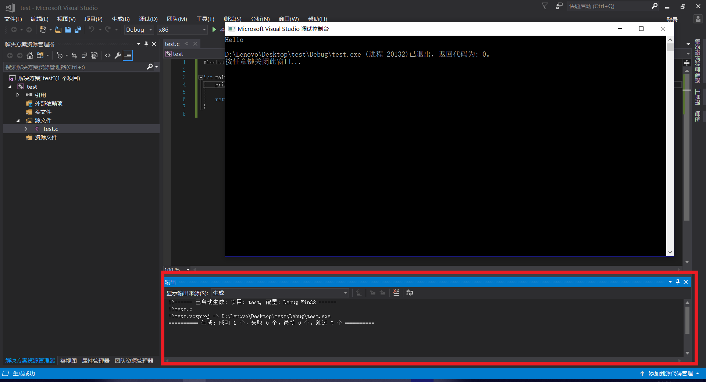
