# 用Construct2制作游戏

Construct 2是Scirra公司开发的以HTML5为基础的一款2D游戏编辑器。即使是无程序设计基础者也可以轻松通过这个编辑器制作游戏，只需在可视化编辑器中进行拖放动作，即可完成一个游戏。

## 1. 下载与安装

首先进入[Scirra官网](https://www.scirra.com/construct2)点选Download下载Construct 2的安装包。

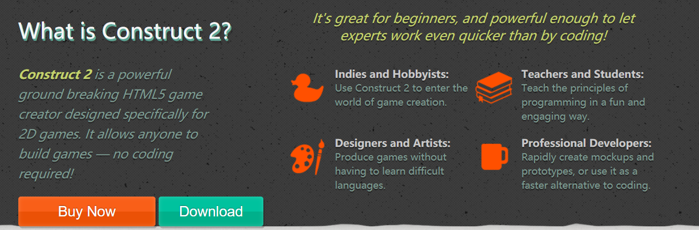

下载后依提示进行安装

## 2. 创建一个新项目

打开Construct 2后将会看到如下画面

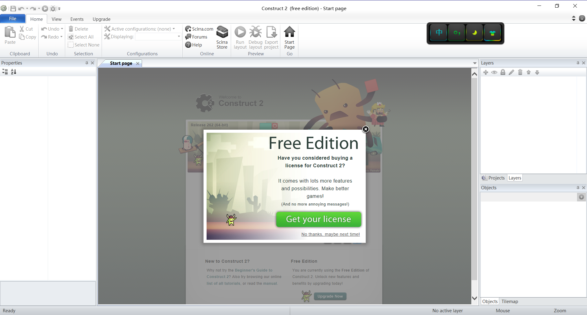

选择左上角的 _**Flie**_ 按钮并点击 _**New**_ 

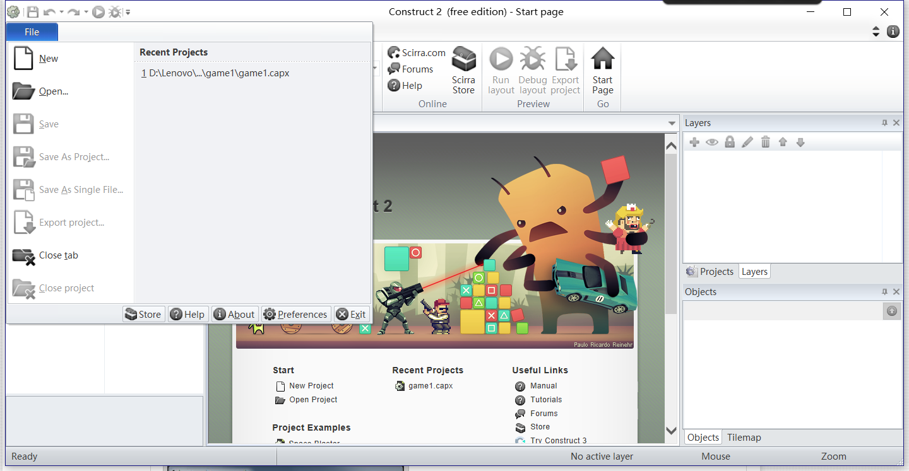

Construct 2 会提示我们选择模板，在这里有许多预设好的模板。

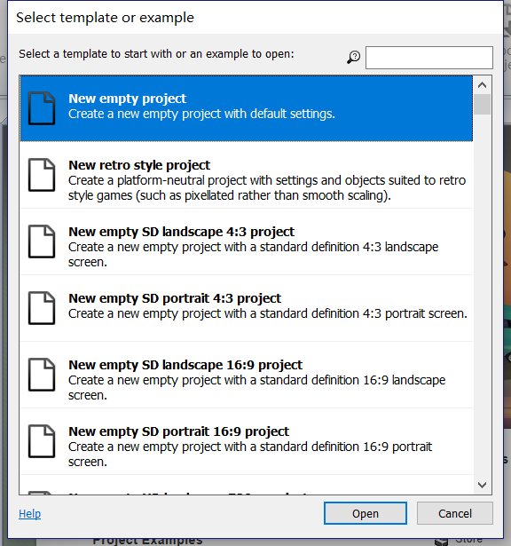

现在我们只是新建一个空白的项目。选择 _**New empty project**_ 并点击 _**Open**_ 
之后便进入进入如下工作界面

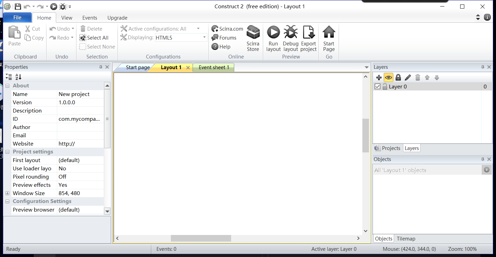

## 3. 添加背景

一个游戏首先需要有一个背景图片。右键单击中间布局区域并选择 _*insert new object*_ 双击出现的对话框中的 _*Tiled background*_ 以添加一个背景的对象。

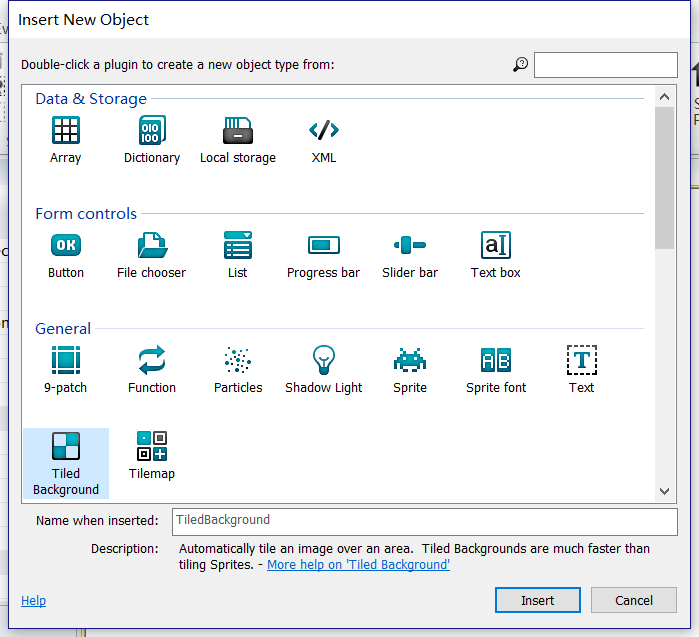

在这之后鼠标会变成一个十字，点击中间布局区域后会弹出一个对话框。点击文件夹图标以选择背景图。然后关闭对话框。

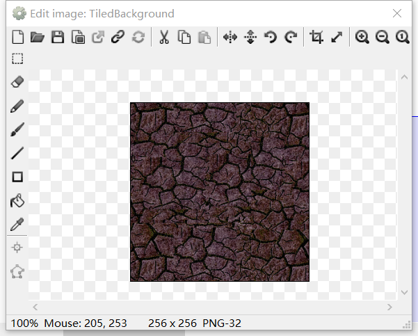

点击我们刚刚创建的背景图对象，我们可以在左方属性栏处调节 _**Position**_ 与 _**Size**_ 属性控制其位置与大小使背景覆盖整个布局

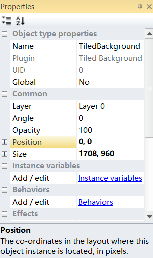

## 4. 添加新的布局

Construct 2中可以设置多个图层， 这一点就像Photoshop一样。它允许我们轻松地安排哪些对象出现在其他对象之上，并且可以隐藏，锁定图层，应用视差效果等等。要管理图层，我们需要选择 _**Layers**_ 选项卡，该选项卡通常位于 _**Projects**_ 栏旁边.在这里我们新了一个图层并命名为Main永远放置游戏角色、怪物等对象。并锁定了背景图层防止误选到背景图层。

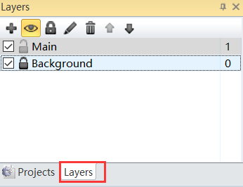

## 5. 添加行为

就像添加背景对象一样，我们用同样的方法添加 **Player**、**Monster**、**Bullet**、**explore**四个对象。但这次我们用 _**Sprite**_ 添加。并通过按住 _Ctrl_ 键拖动 **Monster** 创建更多 **Monster** 的实例。

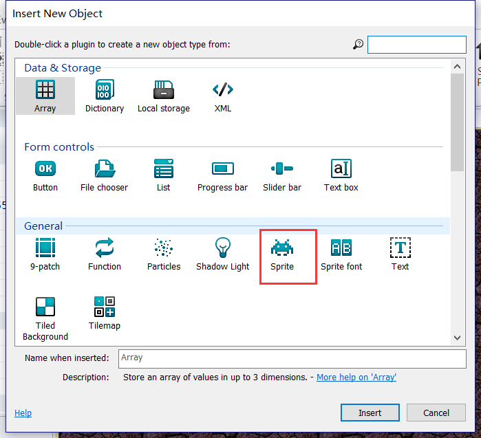

加入这些对象后我们可以为在属性栏处他们添加一些行为

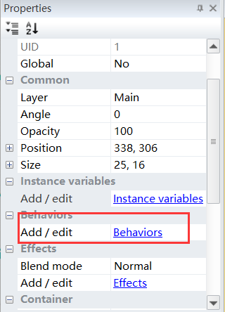

* _**8 Direction movement**_ ：这使我们可以使用方向键移动对象。用于 **Player**。
* _**Bullet movement**_ ：这只是以当前角度向前移动一个物体。用于 **Bullet**、**Monster**
* _**Scroll to**_ ：这使得屏幕在移动时跟随对象（也称为滚动）。用于 **Player**
* _**Bound to layout**_ ：这将阻止一个对象离开布局区域。用于 **Player**
* _**Destroy outside layout**_ ：对象离开布局区域时摧毁它。用于 **Bullet**
* _**Fade**_ ：这逐渐使物体淡出。用于 **explore**

同样，行为的属性也可以在属性栏处设置。

## 6. 添加事件

通过点选 _**Event sheet**_ 选项卡进入创建事件的界面。通过建立事件，我们可以实现发射子弹、击杀怪物等。

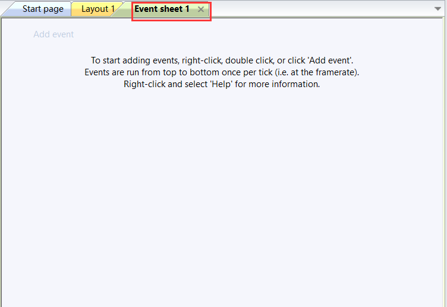

点击 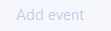 后根据提示选择事件触发条件以及事件。

如下便是添加好的事件

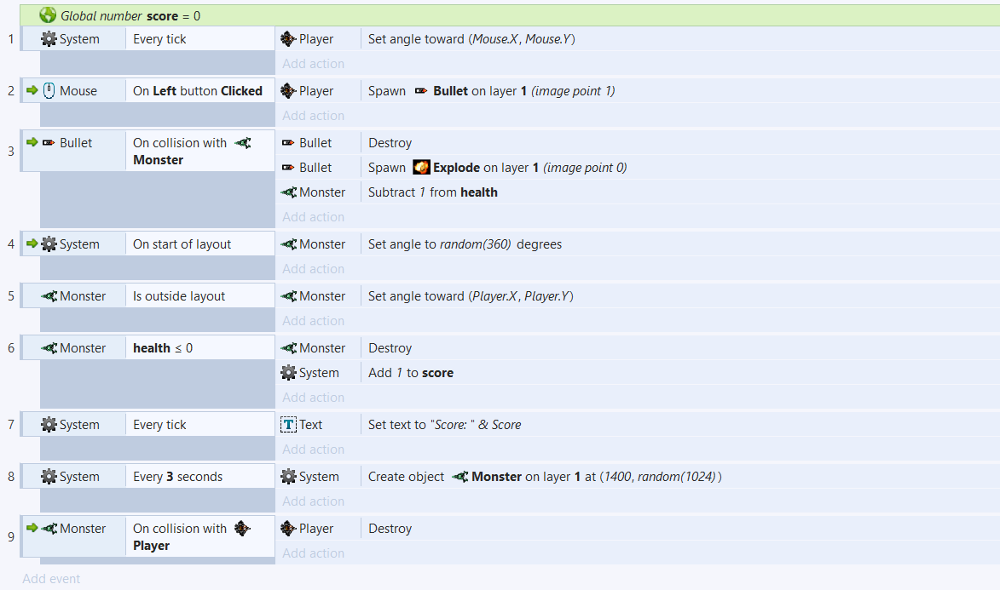
其作用分别是
1. 使 **Player** 始终朝向鼠标
2. 左键单击发射 **Bullet**
3. **Bullet** 碰到 **Monster** **Bullet** 消失，出现 **Explore** 并使 **Monster** 的生命减一
4. 刚开始出现的 **Monster** 行进方向随机
5. **Monster** 走出布局范围后重新向 **Player** 方向前进
6. **Monster** 生命为0时死亡并分数加一
7. 显示分数
8. 游戏开始每3秒生成一个 **Monster**
9. **Monster** 接触 **Player** 后 **Player** 死亡

## 7. 添加变量

看到这里你可能会疑惑在上面提到的怪物的生命值与分数是如何实现。
我们可以通过添加全局变量以及为 **Monster** 添加 实例变量来实现分数与生命值。

首先我们为 **Monster** 添加变量。在 _**Object**_ 处选择 **Monster** 然后在左边属性栏处的 _**Instance variables**_ 属性添加新的变量

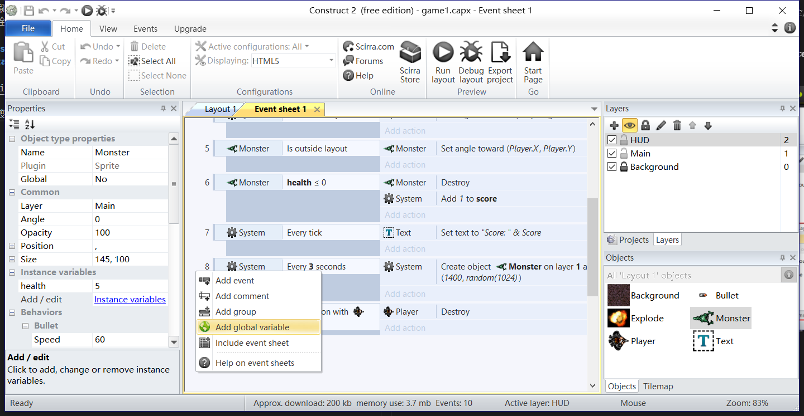

然后我们添加全局变量。在事件栏的空白处右键然后选择 _**Add global variable**_ 添加。

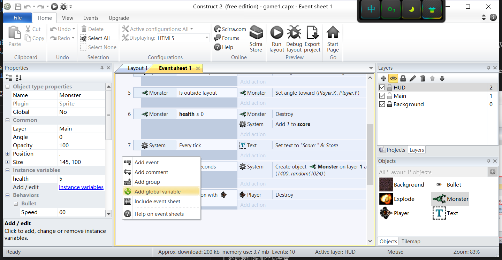

## 8.运行游戏

这样游戏就做好了。我们可以通过上方的 _**Run Layout**_ 来运行它。

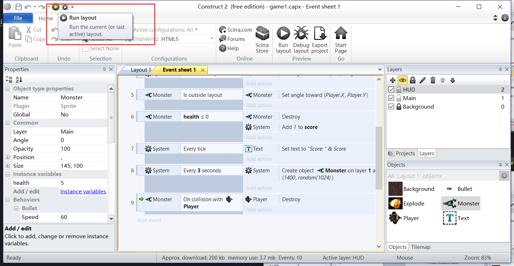

游戏效果

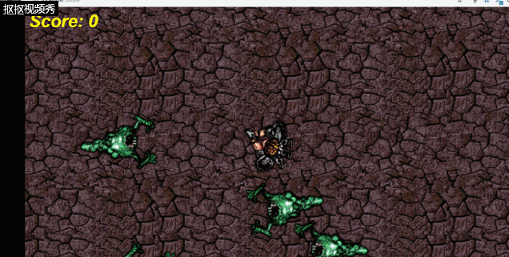