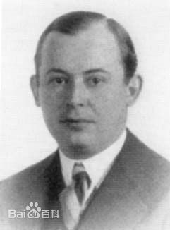
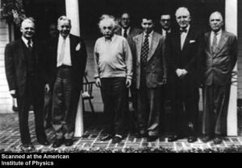
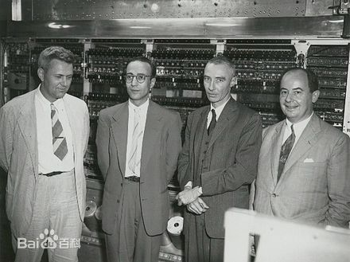
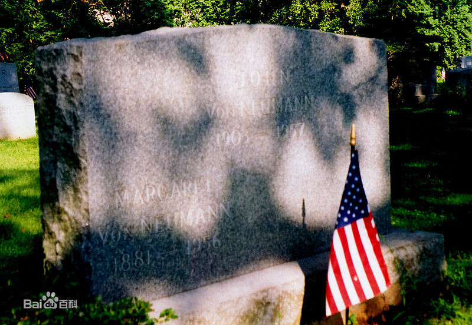

# 计算机之父——约翰·冯·诺伊曼

**约翰·冯·诺伊曼** （John von Neumann），匈牙利裔美国籍犹太人数学家、物理学家、计算机科学家。他在为众多领域如：数学、物理学、经济学、计算机科学等做出了巨大的贡献。被后人称为“计算机之父”和“博弈论之父”。是20世纪最重要的数学家.

  
_约翰·冯·诺伊曼_

冯·诺伊曼是个神童和天才，在他六岁时他就能够心算两个八位数的除法和用古希腊语交流。八岁的时候变能够熟练运用微积分。在他十五岁时，他的跟从著名匈牙利数学家 Gábor Szegő 学习高级微积分。Gábor Szegő第一次与冯·诺依曼见面就被冯·诺依曼的聪明震惊到哭了。当1963年获得诺贝尔物理学奖得主维格纳被问及为什么他这一代的匈牙利人产生了如此多的天才时，他回答说：“冯·诺伊曼是唯一的天才。”

  
_小时候的冯·诺依曼_

在冯·诺伊曼十八岁那年，他和他的父亲达成妥协，攻读化学。他在布达佩斯大学注册为数学系的学生，但并不听课，只是每年按时参加考试。同时，冯·诺依曼进入柏林大学，随后又进入瑞士苏黎世联邦工业大学学习化学。通过这种方式，冯诺依曼同时取得了苏黎世联邦工业大学化学系的大学毕业学位以及布达佩斯大学数学博士学位。

  
_年轻时的冯·诺依曼_

在他27岁的时候，他成为普林斯顿大学的客座讲师。不久后普林斯顿大学就聘冯·诺依曼为客座教授。1933年，年仅三十岁的冯·诺伊曼便和物理学家爱因斯坦、数学家维布伦(Oswald Veblen)、数学家亚历山大(James Alexander)一起成了高等研究院最初任命的四位教授。

  
_爱因斯坦与冯·诺依曼的合照_

二战爆发后,随着美国正式参战，核技术的研究越来越紧迫。冯·诺依曼成了曼哈顿计划的顾问。在此之前，冯·诺依曼已经参与了同反法西斯战争有关的多项科学研究计划。少时父亲逼迫之下学习的化学工程意外派上了用场，他很容易明白物理学家和化学家的讨论，再用数学的语言解释给数学家听。原子能委员会主席斯特劳斯曾对他作过这样的评价：从他被任命到1955年深秋，冯·诺依曼干得很漂亮。他有一种使人望尘莫及的能力，最困难的问题到他手里。都会被分解成一件件看起来十分简单的事情，用这种办法，他大大地促进了原子能委员会的工作。在曼哈顿计划期间由于计算能力这个瓶颈，冯·诺依曼牵头建造了世界上第一台通用计算机—ENIAC,并提出了著名的“冯·诺依曼结构”，标志着电子计算机时代的开始。

  
_冯·诺依曼在世界上第一台计算机前_

1957年，五十三岁的冯•诺伊曼因骨癌病逝。

  
_冯·诺依曼之墓_