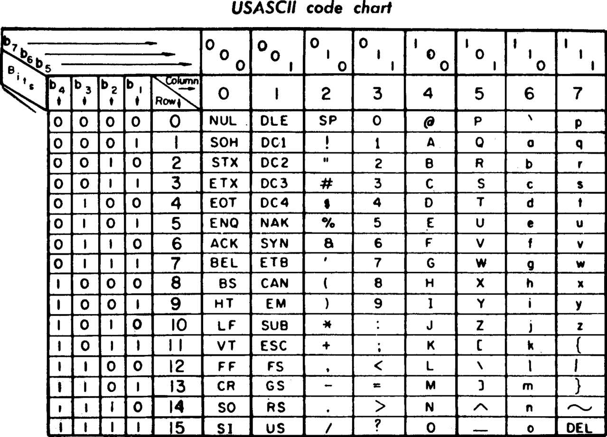
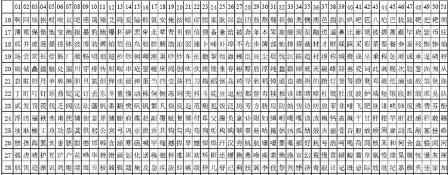
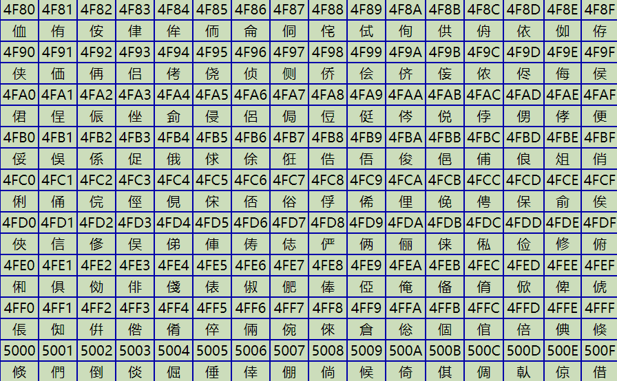
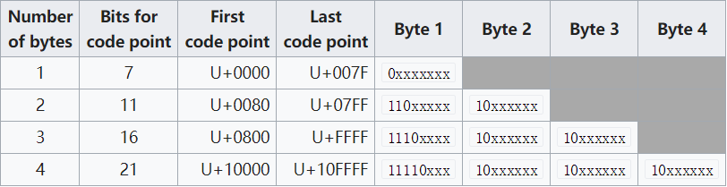

# 字符编码

## ASCII

众所周知，计算机只能够以二进制的方式储存信息。那么要是需要储存字符，则需要把字符转换为二进制。上个世纪60年代，美国制定了一套编码，规定了基于英语的字符与二进制的转换的标准。这套编码被称为ASCII码。其一共规定了128个字符的编码，每个字符用7个位来储存。

  
_早期的ASCII图表_

## ASCII的拓展

由于ASCII码只规定了基于英语的字符的编码，对于其他国家的语言仅仅128个字符是完全不够的。因此，一些欧洲国家便在ASCII码的基础上在加多一位，一共八位直接（一个字节）来储存字符。这样这些欧洲国家的编码体系就可以储存256个字符。

然而，这样便会产生一个问题，那就是即使加多了一位也不可能在一套编码系统中表示所有语言的字符。这就导致同一个ASCII编码在不同国家可能会代表不同的字符。由于亚洲国家的语言体系中的文字众多，一个字节根本不可能储存这么多字符，这个问题更加严重。

   
_GB2312字符集的部分编码表_

## Unicode

正如上文所说，不同国家都有他们自己的编码。不同国家编写出来的程序都难以通用，甚至跨国发送的电子邮件都可能出现乱码怎么能行！为了解决这个问题Unicode产生了。Unicode把所有语言都编到一套字符集中，每一个编码只对应一个字符，并且前128个字符与ASCII保持一致。这样编码的兼容问题便解决了。但是Unicode也有其自己的问题那就是它只是一个字符集，它只规定了每个字符对应的二进制数，但是没有规定其存储方式。并且由于其包含字符过多，如果每个字符都用几个字节来储存将会占用过大的存储空间。这也导致了Unicode在互联网出现之前难以推广以及出现了多种存储方式。

  
_部分汉字与Unicode的对照表_

## UTF-8

互联网普及后，一种统一的编码方式的需求就变得非常强烈。UFT-8就是Unicode的应用最广的一种实现。同样为Unicode的实现的还有UFT-16等，这里我只介绍UFT-8。前面提到过，如果每个Unicode字符都用几个字节来储存将会占用过大的存储空间。所以UFT-8的一大特点就是UFT-8是一种可变长的编码方式。它用一到四的字节储存字符，根据字符的不同来决定储存字节的长度，具体取决于字符在Unicode中编码的有效位数。下表显示了编码的结构。x由字符在Unicode中的编码所取代。如果有效位数不超过7，则应用第一行; 如果不超过11​​位，则应用第二行，依此类推。这样UTF-8编码的前128位甚至与ASCII码完全一致

   
_UFT-8编码参照表_

我们以字符'中'为例,演示如何获取其UTF-8编码。'中'的Unicode码为$(4E\quad2D)_{16}$即\((01001110\quad00101101)_{2}\)在第三行(0080 - 07FF)范围内。因此储存'中'用三个字节，格式为1110xxxx 10xxxxxx 10xxxxxx 。然后把'中'的Unicode码依次代入x中，就得到'中'的UTF-8编码$(11100100\quad10111000\quad10101101)_{2}$十六进制便是\((E4\quadB8\quad80)_{16}\)