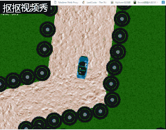

# 赛车

## 楔子(Setting)：

汤姆受邀参加赛车比赛，奖金非常丰厚， 但他需要在规定时间内跑完一圈才能获得胜利。

## 人设与道具（Game Sprites）：

玩家：赛车。可以前后移动，左右转向。但只能在前后移动时转向。  
障碍物：轮胎。赛车碰到轮胎后便会停下。

## CRC卡片:

| 卡片1 | |
|:-------------------|:------------------|
| Object Name        |赛车|
| Attributes         |图片，最大速度，加速时的加速度，减速时的加速度，漂移恢复速度|
| Collaborator       |精灵|
| Events & Actions   |前后移动，左右转弯，碰到轮胎减速|

| 卡片2 | |
|:-------------------|:------------------|
| Object Name        |轮胎|
| Attributes         |图片|
| Collaborator       |精灵|
| Events & Actions   |阻挡赛车|

游戏演示  

