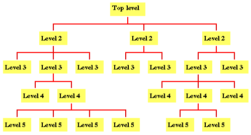

## 洗衣机算法设计

当我们需要设计一个算法时，首先我们要考虑的是用怎么样的设计方法去分析问题。最常用的方法便是"自顶向下，逐步求精"（Top-down design）的方法。

所谓"自顶向下，逐步求精"便是将一个大的问题分解为多个子问题，然后不断细分直到不能再分解为止。  

这样我们便会得到一棵树  
 

这棵树的每一片叶子都是相对容易解决的小问题。而将这些小问题解决了，原来的大问题也就解决了。

接下来我们回到洗衣机算法的问题，洗衣机洗衣程序可以划分为如下几步  
```
water_in()//注水
soak()//浸泡
wash()//洗涤
rinse()//漂洗
dehydrate()//脱水
halt//停机
```

我们假设洗衣机可执行的基本操作如下：
water_in_switch(open_close) // open 打开上水开关，close关闭  
water_out_switch(open_close) // open 打开排水开关，close关闭  
get_water_volume() //返回洗衣机内部水的高度  
motor_run(direction) // 电机转动。left左转，right右转，stop停  
time_counter() // 返回当前时间计数，以秒为单位  
halt(returncode) //停机，success 成功 failure 失败 

那么洗衣程序就可以进一步划分

```
//等待
SET Function wait(time)
    SET start_time = time_counter()
    WHILE time_counter() < start_time + time
        DO nothing
    END WHILE
END wait

//注水
SET Function water_in(setting_water_volume, timeout)
    SET start_time = time_counter()
    water_in_switch(open)
    WHILE get_water_volume() < setting_water_volume
        IF time_counter() > start_time + timeout THEN
            halt()
        END IF
    END WHILE
    water_in_switch(close)
END water_in

//排水
SET water_out(time_out)
    water_out_switch(open)
    SET start_time = time_counter()
    WHILE get_water_volume() > low_water_volume
        IF time_counter() > start_time + timeout THEN
            halt()
        END IF
    END WHILE
    water_out_switch(close)
END water_out


//浸泡
SET Function soak()
    wait(soak_time)
END soak

//洗涤
SET Function wash()
    SET counter = 0
    WHILE counter < wash_times
        motor_run(right)
        wait(rotation_time)
        motor_run(left)
        wait(rotation_time)
        motor_run(stop)
        INCREASE counter
    END WHILE
    water_out(timeout)
END wash

//漂洗
SET Function rinse()
    SET counter = 0
    WHILE counter < rinse_times
        water_in(setting_water_volume, timeout)
        wash()
        INCREASE counter
    END WHILE
END rinse

//脱水
SET Function dehydrate()
    motor_run(left)
    wait(dehydrate_time)
    motor_run(stop)
END dehydrate

//停机
halt()
```
上述的伪代码便将洗衣程序转化为洗衣机的基本操作的执行。编写洗衣机的算法这个问题也就解决了

"自顶向下，逐步求精"的设计方法是非常有用的。它可以帮助我们更高效地分析问题，也能让我们更容易在分析的时候发现系统的漏洞。