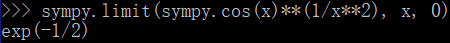
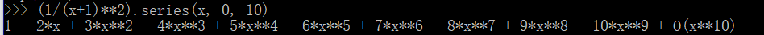
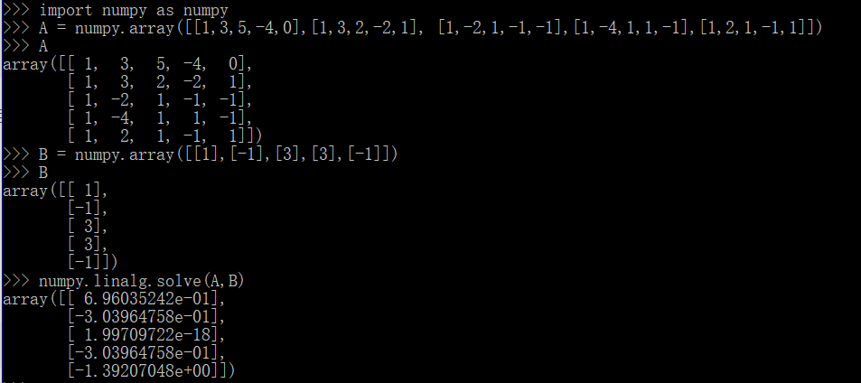
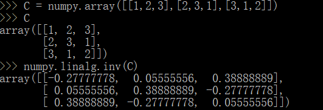

# 使用python求解高数与线代作业

## 高数
求极限  
$$\lim_{x\to0}\left (  \cos{x}\right )^\frac{1}{x^{2}}$$  

展开为麦克劳林级数  
$$\frac{1}{(x+1)^{2}})$$  

## 线代
解线性方程组
$\begin{pmatrix}1 & 3 & 5 & -4 & 0\\ 1 & 3 & 2 & -2 & 1\\ 1 & -2 & 1 & -1 & -1\\ 1 & -4 & 1 & 1 & -1\\ 1 & 2 & 1 & -1 & 1\end{pmatrix}$ X = $\begin{pmatrix}1\\ -1\\ 3\\ 3\\ -1\end{pmatrix}$  

求逆矩阵  
$\begin{pmatrix} 1 & 2 & 3 \\ 2 & 3 & 1 \\ 3 & 1 & 2 end{pmatrix}$  

