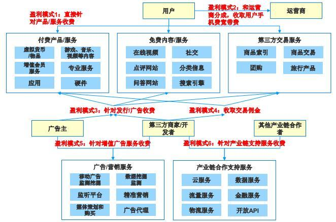

# 互联网时代的盈利模式

互联网时代的盈利模式下的一个核心是“流量”。

>有流量一切好说，没流量一切免谈。类似你开一个实体店，每天有100个人从你店面前走过和每天有1000W人从你店面前走过的概念类似。至于怎么赚钱看你的营销手法了。但是流量是前提。有了流量一切都有可能。无非是盈利手法问题。买卖数据，广告，自营产品都是可以的。

大部分的盈利模式都是的盈利模式都是通过流量来换取收益的。可以说流量是一切收益的前提。

虽然说流量是核心，但是并不代表有流量就一定能够盈利.如何合理通过流量盈利而不使用户反感也是一个很重要的问题。

>有了羊，下一步只是毛出在哪里的问题。这可是个不容易的问题。因为如果你要剪羊毛，但是一下子剪痛了，羊跑了，那可就全完了。

把所有重点放在如何获取流量显然是不行的。

那么，有了流量以后一般通过什么样的方式盈利呢，主要有下面几种：

1. 用户付费  
这种模式通过出售软件盈利。如Appstore的付费应用,steam上的付费游戏等等。但是，在中国，许多个人用户都没有购买付费软件的习惯，企业付费购买使用占了大部分。

2. 免费服务用户，收取增值费  
现在的许多网游，手游都是用这种方式盈利，游戏免费道具收费。或者视频网站付费vip去广告等等。

3. 收取交易佣金  
电商以及O2O网站针对交易提成。

4. 投放广告  
这是最常见的盈利模式。通过提供免费的服务，吸引流量，再通过广告把流量变现。

5. 核心功能免费，同时导流到其他付费服务  
比如微信，微信聊天是免费的，但是微信内置了很多其他服务，游戏、支付、京东、滴滴打车，这些服务都有可能是收费的。

互联网的盈利模式并不仅限于上面几种，并且往往是多种盈利模式组合使用。

